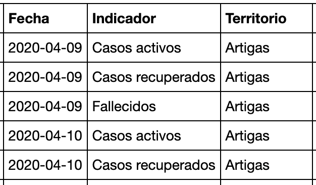
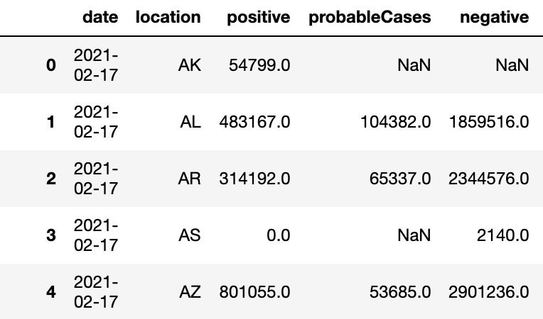
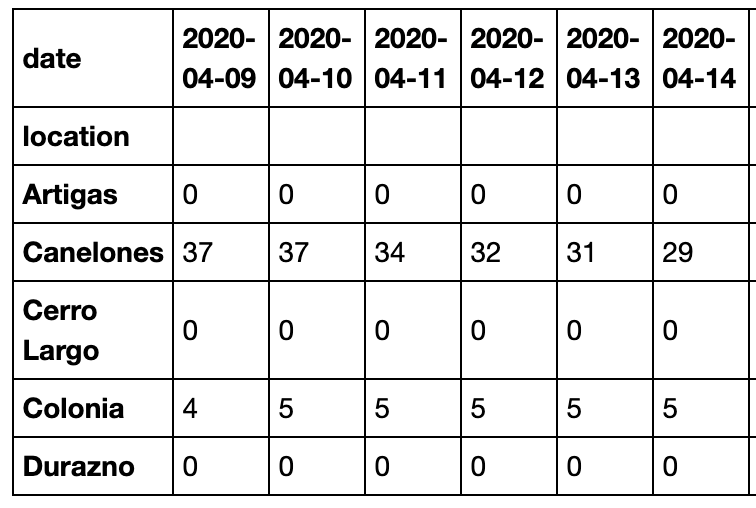
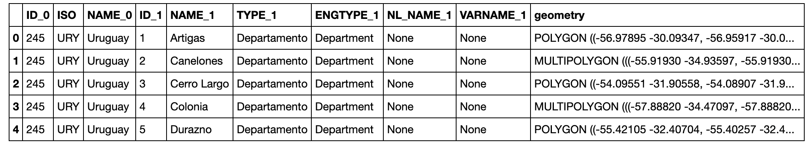
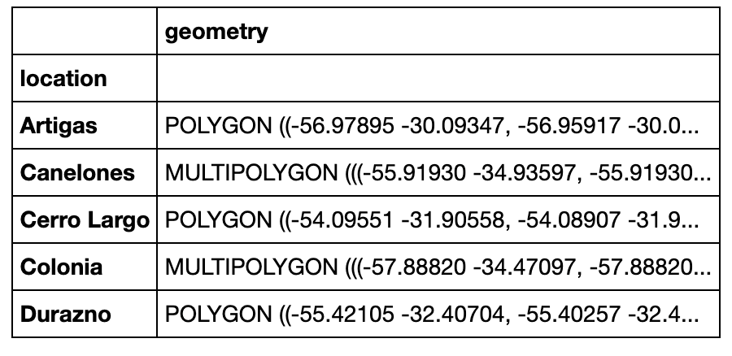
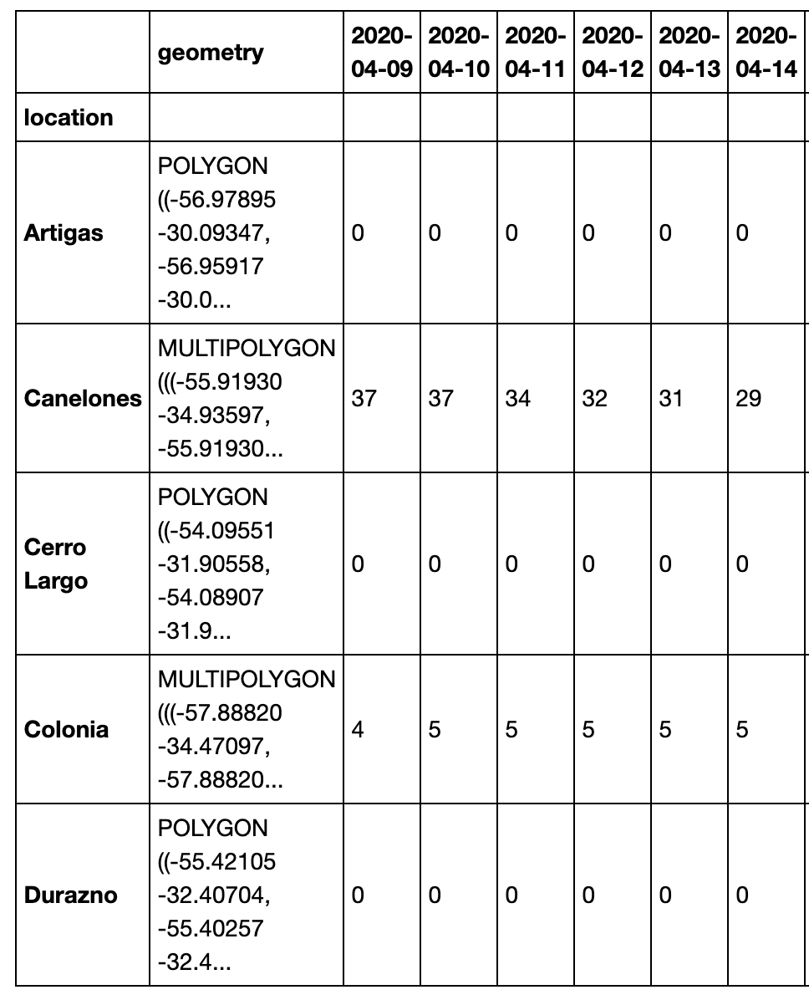

# ChoroMap
ChoroMap is a tool to create **animated choropleth maps**, a.k.a. heat maps.  It can easily be used in a Jupyter notebook and all it takes is a *pandas DataFrame* with dates and values, as well as geographic [shapefiles]('https://desktop.arcgis.com/en/arcmap/10.3/manage-data/shapefiles/what-is-a-shapefile.htm').  
<br>


<br><br>

## 1. Install Instructions
1. **Clone the repo from GitHub**  
`git clone https://github.com/javierorman/choromap {folder}`  
Replace `{folder}` with the name or path of the folder where you'd like to host the module. If left blank, the module will install the current directory.  

---The rest of the instructions assume that **Anaconda** is installed. If not, it's possible to re-create the same steps with **pip**.---

2. **Install requirements**  
- To create a new environment: `conda env create -f environment.yml`  
This will create a new *anaconda environment*. The name is set on the first line the `environment.yml`, which can be edited.  
- To use an existing (activated) environment: `conda env update --file environment.yml`

3. **Module location**  
- Add module's location to `sys.path`  
In Jupyter notebook or a script, this can be done as follows:  
    ```
    import sys

    if module_path not in sys.path:
        sys.path.append(module_path)
    ```
    For example, if module is in subfolder `/choromap` of the working directory, we can set `module_path` like this:  
    ```
    from pathlib import Path
    
    module_path = str(Path.cwd()) + '/choromap'  

4. **Import**  
The recommended way to import is as follows:  
```
from choromap import ChoroMapBuilder, DataFramePrepper
```  
---
<br>

## 2. Prepare DataFrames 
There are two DataFrames that are passed as inputs to **ChoroMap**: one with time-series data (`info_df`) and one with geospatial data (`geom_df`).  
The DataFrames will be manipulated via the `DataFramePrepper()` class, which should be instantiated as follows: 

    prepper = DataFramePrepper(info_df, geom_df)


**1. Time-series DataFrame**  
In the code, this DataFrame is `info_df`. It should be passed to `DataFramePrepper.prep_info_df()` method (description of parameters available via `help(DataFramePrepper.prep_info_df)`).

It can be a *long* or *wide* DataFrame with values and dates that you'd like to visualize. In both cases, there should be:  
- 1 column for dates  
- 1 column for locations  

In *long* DataFrames, **all categories are in one column**.  
When using `DataFramePrepper.prep_info_df()`, make sure to  specify `long=True` (default is `False`).  

Example:


<br><br>

- Here, "`Fecha`" ("Date") gets its own column  
- In this example, "`Indicador`" ("Indicator") may contain several categories. Choose one to visualize, for example "`Casos activos`" ("Active cases")  
- "`Territorio`" ("Territory") here contains the names of locations  
- There is another column outside the frame containing the value for each location, for each date, for each category.  

See [this Jupyter notebook](https://github.com/javierorman/choromap/blob/master/covid19_uruguay/covid19_uruguay.ipynb) to see ChoroMap build an animated heat map based on this DataFrame. 

<br>

In *wide* DataFrames, **each category will have its own column**.  
When using `DataFramePrepper.prep_info_df()`, leave argument`long` set to the default `False`)

Example of *wide* DataFrame:  



Notice that dates and locations still have their own columns.  

<br>

The end-result of `DataFramePrepper.prep_info_df()` looks like this:  

  

Notice:  
- *Locations* are in the index  
- *Dates* are now columns  
- Values correspond to the category specificed as an argument, in this cases "`Casos activos`"

**2. Geospatial DataFrame**  

In the code, this DataFrame is `geom_df`. It should be passed to `DataFramePrepper.prep_geom_df()` method, which only takes 2 parameters: the column containing *location names* and the column containing *geospatial data*.  

Example:  
Here we are only interested in columns `NAME_1`, which contains location names and `geometry`, which contains geospatial information:



We call the `prep_geom_df()` method: 

    prepper.prep_geom_df(location_col='NAME_1', geometry_col='geometry')

The result looks like this:  

  

**3. Merge DataFrames**  
Finally, call `DataFramePrepper.merge_info_geom()` to merge the 2 DataFrames. Typically, no arguments will be nessary.  
The output looks like this:  


<br><br>

It looks just like the output of `prep_info_df()` but with the "`geometry`" column added at the start.  


---
<br>

## 3. Build ChoroMaps  

The class `ChoroMapBuilder()` contains all necessary tools to now build the maps. We instantiate it by passing `merged_df` from the last step:

    builder = ChoroMapBuilder(merged_df)

The only step left is to call the `ChoroMapBuilder.make_map()` method. Information on the available parameters available via `help(ChoroMapBuilder.make_map)`.

Example:

    builder.make_map(title='Rate of current COVID-19 hospitalizations in each state',
                      subtitle='Source: The COVID Tracking Project at The Atlantic', 
                      unit='COVID-19 hospitalizations per 100,000 residents',
                      save_name='hosp_curr_us_100000',
                      count='all', 
                      begin_date='2020-03-01',
                      color='Reds', 
                      fps=6)

<br>

Keep in mind that this function can take a while to execute (up to several minutes), especially if there are a lot of dates to plot.  

`make_map()` stores individual frames as `.png` files in `charts/maps`, and the final video in `charts/exports`. The video also gets displayed automatically if working in a Jupyter notebook.  
